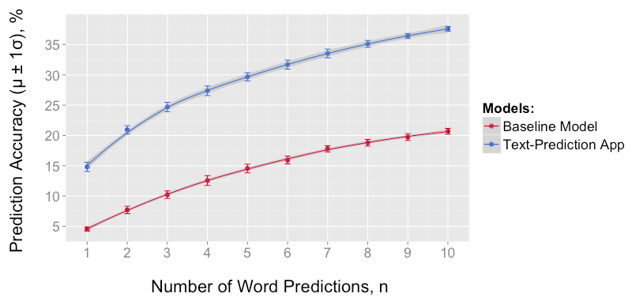

# Data Science Capstone Project - Text-Prediction

## About

This application, made specifically for the capstone project of the Johns Hopkins University Data Science Specialization Certificate Program (Coursera), predicts the next word of the user’s text input. This model was developed using 500,000 randomly sampled lines from blogs, news stories, and twitter. A modified Katz Back-Off model was developed using n-word sequences (n-grams) ranging from 2 to 6 words. Frequent n-grams were identified and used to calculate probabilities. Numbers, punctuation, capitalization, and profanity were removed. In addition to the next word, this application displays a prediction data table, plot, and wordcloud.

## Files

**1_load_data.R** - inputs raw text data    
**2_sample_data.R** - randomly samples 500,000 lines from raw data (training data set)    
**3_clean_data.R** - combines data sets, labels profanity, tokenizes into words     
**4_make_ngrams.R**  - creates n-gram table (n=6)     
**5_process_ngrams.R** - creates n-gram frequency tables (n=6,5,4,3,2,1) with > 1 frequency     
**6_model.R** - function that predicts next word using n-gram frequency tables    
**7_test_model.R** - randomly samples 100,000 lines from raw data, creates n-grams (testing data set)   
**8_test_results.R** - randomly samples 2,500 n-grams from testing set, calculates accuracy of model   
**9_test_plot.R** - plots accuracy of text-prediction model vs. baseline model    
**accuracy_plot.png** - plot of text-prediction model vs. baseline model    
**app_instructions.png** - picture of app with instructions      
**README.md** - readme file
**README.Rmd** - readme file with source code

**/shiny_text_prediction_app/**         
&nbsp;&nbsp;&nbsp;&nbsp;&nbsp;**model.R** - function that predicts next word using n-gram frequency tables for shiny app     
&nbsp;&nbsp;&nbsp;&nbsp;&nbsp;**server.R** - shiny app server function, loads model.R   
&nbsp;&nbsp;&nbsp;&nbsp;&nbsp;**ui.R** - shiny app user interface     

&nbsp;&nbsp;&nbsp;&nbsp;&nbsp;**/shiny_text_prediction_app/data/**        
&nbsp;&nbsp;&nbsp;&nbsp;&nbsp;&nbsp;&nbsp;&nbsp;&nbsp;&nbsp;**ngrams_limit.Rdata** - n-gram frequency tables data file for shiny app      

&nbsp;&nbsp;&nbsp;&nbsp;&nbsp;**/shiny_text_prediction_app/www/**       
&nbsp;&nbsp;&nbsp;&nbsp;&nbsp;&nbsp;&nbsp;&nbsp;&nbsp;&nbsp;**bootstrap.css** - CSS theme for shiny app     

## Instructions

1. Type in a word or phrase into the "text input" box
2. Click the "submit" button
3. The best next-word prediction will be displayed on the "prediction" tab
4. Select other tabs to view the prediction "data table", "plot", and "wordcloud"

## Accuracy

Accuracy was determined by comparing the predicted word(s) to the observed word in a test data set of 2,500 randomly sampled n-grams. This analysis was repeated 5 times to obtain standard deviation error. These results were significantly better (approximately 10-15%) than a baseline model (most frequent words, 1-grams (i.e. the, to, a)).

- Single Word Prediction Accuracy: 14.8% +/- 0.8%
- Top-3 Words Prediction Accuracy: 24.7% +/- 0.8%
- Top-5 Words Prediction Accuracy: 29.7% +/- 0.7%
- Top-10 Words Prediction Accuracy: 37.6% +/- 0.4%

## Simplifications

In order to create an application within the limitations of my desktop computer and shinyapps.io, only 500K lines of the raw text data was used to train the model. Furthermore, the n-gram frequency tables were limited to values with frequencies greater than 1 in order to decrease the amount of storage/memory needed.

## Data Processing

1. Data Source: HC Corpora, corpora.heliohost.org
2. Training Set: US blogs, news, and twitter (500K lines of text)
3. Removed capital letters, numbers, punctuation, and symbols
4. Profanity words filtered and labeled (PROFANITY_WORD)
5. Tokenized text and created n-grams (n=1,2,3,4,5,6)
6. Created n-gram frequency tables (limited to frequencies > 1)
7. Converted to data.table objects for faster lookup

## Algorithm

1. Process text input from user (separate into n words)
2. Search (n+1)-gram frequency table for matches
3. Calculate probabilities of each match (frequency/total)
4. If no matches, search the next lower-order n-gram table
5. If no match in 2-gram table, use most frequent 1-grams
6. Return word with the highest probability score (0-1, 1=best)

## Technical

This application was created using R 3.1.3, Rstuido Version: 0.98.1103, and R packages: stylo 0.5.9, ggplot2 1.0.1, data.table 1.9.4, wordcloud 2.5, RColorBrewer 1.1-2, and shiny 0.11.1 using a Macbook Pro (2.2 GHz Intel Core 2 Duo 64-Bit Processor, 4 GB RAM) on Mac OS X 10.10.3 (XQuartz 2.7.7).

## References

Katz, S. M. (1987). Estimation of probabilities from sparse data for the language model component of a speech recogniser. IEEE Transactions on Acoustics, Speech, and Signal Processing, 35(3), 400–401.
