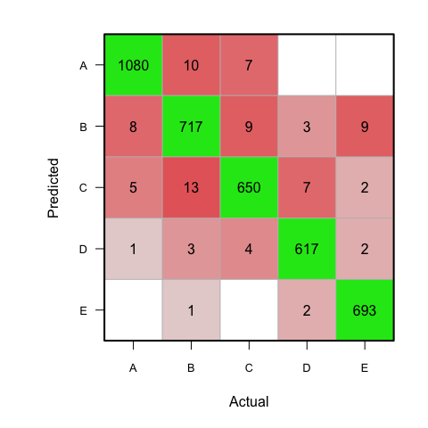

# Qualitative Activity Recognition - Weightlifting

## Introduction

Human Activity Recognition (HAR) is emerging as a key research area, in particular due to the development of context-aware systems (Jawbone Up, Nike FuelBand, and Fitbit ). There are many potential applications for HAR, such as: elderly monitoring, log systems for weight-loss, and digital assistants for weight lifting exercises.

This project analyzes accelerometer data from weightlifting exercises and develops models to predict whether the exercises were performed correctly or incorrectly. Accelerometers were placed on the belt, forearm, arm, and dumbbell of six male participants between 20-28 years old. Participants were asked to perform lifts using a 1.25 kg dumbbell correctly and incorrectly in four different ways. The participants performed one set of 10 repetitions of the Unilateral Dumbbell Biceps Curl in five different fashions: according to the specification (class A), throwing elbows to the front (class B), lifting the dumbbell only halfway (class C), lowering the dumbbell only halfway (class D), and throwing hips to the front (class E). In sum, class A corresponds to the correct execution of the exercise, whereas the other four classes correspond to mistakes.

## Methods

Data analysis was performed on:  

* R Version: 3.1.2  
* Rstuido Version: 0.98.1091  
* Operating System: Mac OS X 10.10.2  
* Hardware: Macbook Pro, 2.2 GHz Intel Core 2 Duo, 4 GB RAM   

Data Source: Velloso, E.; Bulling, A.; Gellersen, H.; Ugulino, W.; Fuks, H. Qualitative Activity Recognition of Weight Lifting Exercises. Proceedings of 4th International Conference in Cooperation with SIGCHI (Augmented Human '13). Stuttgart, Germany: ACM SIGCHI, 2013.

The raw data for this project came from this source: http://groupware.les.inf.puc-rio.br/har. The training data for this project are available here: https://d396qusza40orc.cloudfront.net/predmachlearn/pml-training.csv, and the test data are available here: https://d396qusza40orc.cloudfront.net/predmachlearn/pml-testing.csv.

## Data Analysis and Results

### Load Libraries and Set Seed for Reproducibility


```r
# load libraries and set seed
library(caret)
library(randomForest)
set.seed(5150)
```

### Import and Clean Data

Removed unnecessary and N/A features, which reduced the number of possible features from 160 to 52 (raw accelerometer data).


```r
# input training data
training_input <- read.csv("pml-training.csv", header=TRUE, na.strings=c("","NA"))
```


```r
# clean data (remove un-necessary features nd NA/blank variables)
training_input_no <- subset(training_input, new_window == "no")
training_input_nona <- training_input_no[,colSums(is.na(training_input_no)) != nrow(training_input_no)]
training_input_nona_subset <- subset(training_input_nona,
            select=-c(X, user_name, raw_timestamp_part_1, raw_timestamp_part_2,
                         cvtd_timestamp, new_window, num_window))
```

<br><br><br>

### Data Partitioning

Partitioned the training data into 3 groups (training, testing, and validation) (60:20:20 ratio). The "my training" group was used to fit the models. The "my testing" group was used for iterative cross-validation in the model selection process. The "my validation" group was used after model selection for final cross-validation and to determine model fit (accuracy and out-of-sample error). **NOTE: The "my testing" group is different than the "testing" dataset provided for the course project submission. See the Project Testing Set Submission section below.**


```r
# partition training dataset into training, testing, and validation (60:20:20 ratio)
inTrain <- createDataPartition(training_input_nona_subset$classe, p = 0.6)[[1]]
my_training <- training_input_nona_subset[inTrain,]
testing_validation <- training_input_nona_subset[-inTrain,]
inTest <- createDataPartition(testing_validation$classe, p = 0.5)[[1]]
my_testing <- testing_validation[inTest,]
my_validation <- testing_validation[-inTest,]
```

### Machine Learning Modeling

Models were fit using the train() function (caret package) on the "my training" data group. The "my testing" data group was used for prediction and cross-validation during model selection. Out of all the tested algorithms, the Random Forest model ("rf") resulted in the highest prediction accuracy (99%) of the "my testing" data group. The random forest model used k-fold cross-validation ("cv") with 10 folds.

The additional algorithms investigated were "rpart", "lda", and "gbm" (see Appendix). The prediction accuracy of these models using the "my testing" data group was approximately 49%, 69%, and 96% respectively.


```r
# best model "rf" and use cross-validation 10-fold
model_final <- train(classe ~ ., data=my_training, method="rf",
       trControl = trainControl(method = "cv", number = 10)) # -> 100%  
```


```r
# display best model information
model_final
```

```
## Random Forest
##
## 11532 samples
##    52 predictor
##     5 classes: 'A', 'B', 'C', 'D', 'E'
##
## No pre-processing
## Resampling: Cross-Validated (10 fold)
## Summary of sample sizes: 10379, 10378, 10380, 10378, 10379, 10379, ...
## Resampling results across tuning parameters:
##
##   mtry  Accuracy   Kappa      Accuracy SD  Kappa SD   
##    2    0.9889868  0.9860665  0.001832569  0.002318807
##   27    0.9901152  0.9874951  0.003493365  0.004419963
##   52    0.9826587  0.9780593  0.004562520  0.005770887
##
## Accuracy was used to select the optimal model using  the largest value.
## The final value used for the model was mtry = 27.
```


```r
# best model prediction, cross-validation with "my_testing" data group
pred_final <- predict(model_final, newdata=my_testing)
```


```r
# best model confusion matrix for accuracy results
confusionMatrix(pred_final, my_testing$classe)
```

```
## Confusion Matrix and Statistics
##
##           Reference
## Prediction    A    B    C    D    E
##          A 1091    6    0    0    0
##          B    2  737    7    0    1
##          C    1    1  660   11    2
##          D    0    0    3  616    2
##          E    0    0    0    2  701
##
## Overall Statistics
##                                          
##                Accuracy : 0.9901         
##                  95% CI : (0.9865, 0.993)
##     No Information Rate : 0.2847         
##     P-Value [Acc > NIR] : < 2.2e-16      
##                                          
##                   Kappa : 0.9875         
##  Mcnemar's Test P-Value : NA             
##
## Statistics by Class:
##
##                      Class: A Class: B Class: C Class: D Class: E
## Sensitivity            0.9973   0.9906   0.9851   0.9793   0.9929
## Specificity            0.9978   0.9968   0.9953   0.9984   0.9994
## Pos Pred Value         0.9945   0.9866   0.9778   0.9919   0.9972
## Neg Pred Value         0.9989   0.9977   0.9968   0.9960   0.9984
## Prevalence             0.2847   0.1936   0.1743   0.1637   0.1837
## Detection Rate         0.2839   0.1918   0.1717   0.1603   0.1824
## Detection Prevalence   0.2855   0.1944   0.1756   0.1616   0.1829
## Balanced Accuracy      0.9975   0.9937   0.9902   0.9889   0.9961
```

### Cross-Validation

**After model selection, final cross-validation using the "my validation" data group was used to get an estimation of accuracy and out-of-sample error. The results were aproximtely 99% accuracy or 1% out-of-sample error rate.**


```r
# predition on "my validation" set, note: only ran once
pred_final <- predict(model_final , newdata=my_validation)
```


```r
# plot confusion matrix visualization
# modified code from: http://stackoverflow.com/questions/21589991/
library(mlearning)
plot_confusion <- function(a, b, c) {
    CM <- confusion(a, b)
    opar <- par(mar=c(5.1, 6.1, 2, 2))
    x <- x.orig <- unclass(CM)
    x <- log(x + 0.5) * 2.33
    x[x < 0] <- NA
    x[x > 10] <- 10
    diag(x) <- -diag(x)
    image(1:ncol(x), 1:ncol(x), -(x[, nrow(x):1]), xlab='Actual', ylab='',
            col=colorRampPalette(c(hsv(h = 0, s = 0.9, v = 0.9, alpha = 1),
                    hsv(h = 0, s = 0, v = 0.9, alpha = 1),
                    hsv(h = 2/6, s = 0.9, v = 0.9, alpha = 1)))(41),
        xaxt='n', yaxt='n', zlim=c(-10, 10))
    axis(1, at=1:ncol(x), labels=colnames(x), cex.axis=0.8)
    axis(2, at=ncol(x):1, labels=colnames(x), las=1, cex.axis=0.8)
    title(ylab='Predicted', line=2.5)
    abline(h = 0:ncol(x) + 0.5, col = 'gray')
    abline(v = 0:ncol(x) + 0.5, col = 'gray')
    text(1:c, rep(c:1, each=c), labels = sub('^0$', '', round(c(x.orig), 0)))
    box(lwd=2)
    par(opar)
}
```


```r
# confusion matrix for best model on "my validation" data set
confusionMatrix(pred_final , my_validation$classe)
```

```
## Confusion Matrix and Statistics
##
##           Reference
## Prediction    A    B    C    D    E
##          A 1089    8    0    0    0
##          B    2  732    1    0    1
##          C    3    2  667    3    0
##          D    0    1    2  626    3
##          E    0    0    0    0  701
##
## Overall Statistics
##                                           
##                Accuracy : 0.9932          
##                  95% CI : (0.9901, 0.9956)
##     No Information Rate : 0.2848          
##     P-Value [Acc > NIR] : < 2.2e-16       
##                                           
##                   Kappa : 0.9914          
##  Mcnemar's Test P-Value : NA              
##
## Statistics by Class:
##
##                      Class: A Class: B Class: C Class: D Class: E
## Sensitivity            0.9954   0.9852   0.9955   0.9952   0.9943
## Specificity            0.9971   0.9987   0.9975   0.9981   1.0000
## Pos Pred Value         0.9927   0.9946   0.9881   0.9905   1.0000
## Neg Pred Value         0.9982   0.9965   0.9991   0.9991   0.9987
## Prevalence             0.2848   0.1934   0.1744   0.1638   0.1835
## Detection Rate         0.2835   0.1906   0.1737   0.1630   0.1825
## Detection Prevalence   0.2856   0.1916   0.1757   0.1645   0.1825
## Balanced Accuracy      0.9963   0.9920   0.9965   0.9967   0.9972
```

```r
plot_confusion(pred_final, my_validation$classe, 5)
```

\

<br><br><br>

### Variable Importance and Model Optimization   

The best model (random forest), using all 52 variables/features (99% accuracy), was further investigated for the most important variables in an attempt to reduce the number of variables and shorten algorithm run-time.

The final model was re-evaluated using only the top variables. As can be seen in the variable importance plot below, the top 7 variables appear to be the most important. The top 7 important variables were "roll belt", "pitch forearm", "yaw belt", "magnet dumbbell z", "pitch belt", "roll forearm", and "magnet dumbbell y".

**In sum, the random forest model using only these 7 variables resulted in approximately 98% accuracy and 2% out-of-sample error via cross-validation with the "my validation" data/set. Thus, this optimized model significantly reduced algorithm run-time, while only decreasing prediction accuracy by about 1%.** For situations where processing power and/or time are limited, this model would be a acceptable compromise between run-time and accuracy.


```r
# plot variable importance
vi = varImp(model_final)
plot( vi, col="red", col.line="red", type=c("p","l") )
```

\


```r
# select top x variables in best model
top <- 7
top_var <- varImp(model_final)[[1]]
top_var$variable <- rownames(top_var)
top_var_ordered <- top_var[order(top_var$Overall, decreasing=TRUE), ]
top_x <- top_var_ordered$variable[1:top]
top_x <- c(top_x, "classe")
my_training_top_x <- subset(my_training, select=(top_x))
```


```r
# calculate optimized model
model_final_top_x <- train(classe ~ ., data=my_training_top_x, method="rf",
                   trControl = trainControl(method = "cv", number = 10))
```


```r
# display information on best model - optimized
model_final_top_x
```

```
## Random Forest
##
## 11532 samples
##     7 predictor
##     5 classes: 'A', 'B', 'C', 'D', 'E'
##
## No pre-processing
## Resampling: Cross-Validated (10 fold)
## Summary of sample sizes: 10379, 10378, 10379, 10378, 10379, 10378, ...
## Resampling results across tuning parameters:
##
##   mtry  Accuracy   Kappa      Accuracy SD  Kappa SD   
##   2     0.9808363  0.9757641  0.002691898  0.003409716
##   4     0.9816166  0.9767479  0.003558678  0.004502579
##   7     0.9774535  0.9714831  0.003472546  0.004387483
##
## Accuracy was used to select the optimal model using  the largest value.
## The final value used for the model was mtry = 4.
```


```r
# predictions and cross-validation with optimized model
pred_final_top_x <- predict(model_final_top_x, newdata=my_testing)
pred_final_top_x_v <- predict(model_final_top_x, newdata=my_validation)
```


```r
# confusion matrix for optimized model
confusionMatrix(pred_final_top_x , my_testing$classe)
```

```
## Confusion Matrix and Statistics
##
##           Reference
## Prediction    A    B    C    D    E
##          A 1080   10    7    0    0
##          B    8  717    9    3    9
##          C    5   13  650    7    2
##          D    1    3    4  617    2
##          E    0    1    0    2  693
##
## Overall Statistics
##                                           
##                Accuracy : 0.9776          
##                  95% CI : (0.9724, 0.9821)
##     No Information Rate : 0.2847          
##     P-Value [Acc > NIR] : < 2.2e-16       
##                                           
##                   Kappa : 0.9717          
##  Mcnemar's Test P-Value : NA              
##
## Statistics by Class:
##
##                      Class: A Class: B Class: C Class: D Class: E
## Sensitivity            0.9872   0.9637   0.9701   0.9809   0.9816
## Specificity            0.9938   0.9906   0.9915   0.9969   0.9990
## Pos Pred Value         0.9845   0.9611   0.9601   0.9841   0.9957
## Neg Pred Value         0.9949   0.9913   0.9937   0.9963   0.9959
## Prevalence             0.2847   0.1936   0.1743   0.1637   0.1837
## Detection Rate         0.2810   0.1866   0.1691   0.1606   0.1803
## Detection Prevalence   0.2855   0.1941   0.1762   0.1632   0.1811
## Balanced Accuracy      0.9905   0.9772   0.9808   0.9889   0.9903
```

```r
plot_confusion(pred_final_top_x , my_testing$classe, 5)
```

\


```r
# confusion matrix on "my validation" set
# note: only ran once after model section was complete
confusionMatrix(pred_final_top_x_v , my_validation$classe)
```

```
## Confusion Matrix and Statistics
##
##           Reference
## Prediction    A    B    C    D    E
##          A 1071    7    1    0    0
##          B   14  721    1    3    6
##          C    8    8  665    1    2
##          D    1    5    3  624    1
##          E    0    2    0    1  696
##
## Overall Statistics
##                                           
##                Accuracy : 0.9833          
##                  95% CI : (0.9788, 0.9871)
##     No Information Rate : 0.2848          
##     P-Value [Acc > NIR] : < 2.2e-16       
##                                           
##                   Kappa : 0.9789          
##  Mcnemar's Test P-Value : NA              
##
## Statistics by Class:
##
##                      Class: A Class: B Class: C Class: D Class: E
## Sensitivity            0.9790   0.9704   0.9925   0.9921   0.9872
## Specificity            0.9971   0.9923   0.9940   0.9969   0.9990
## Pos Pred Value         0.9926   0.9678   0.9722   0.9842   0.9957
## Neg Pred Value         0.9917   0.9929   0.9984   0.9984   0.9971
## Prevalence             0.2848   0.1934   0.1744   0.1638   0.1835
## Detection Rate         0.2788   0.1877   0.1731   0.1625   0.1812
## Detection Prevalence   0.2809   0.1940   0.1781   0.1651   0.1820
## Balanced Accuracy      0.9880   0.9813   0.9933   0.9945   0.9931
```

```r
plot_confusion(pred_final_top_x_v , my_validation$classe, 5)
```

\


### Project Testing Set Submission

The provided project testing data set was predicted using the full 52-feature model algorithm. The answers were submitted to the course website and resulted in 20/20 correct predictions.


```r
# input testing set for project submission predictions
project_testing <- read.csv("pml-testing.csv")
```


```r
# make predictions using model
answers <- predict(model_final, project_testing)
answers
```

```
##  [1] B A B A A E D B A A B C B A E E A B B B
## Levels: A B C D E
```

## Conclusions

In conclusion, this project has investigated models to predict weightlifting exercises from accelerometer data. **The best model used the random forest algorithm. Using cross-validation, the accuracy of the random forest model was estimated to be about 99% and out-of-sample error was estimated to be about 1%.**

Moreover, this model was optimized, and the number of features was reduced from 52 to 7. The top 7 important variables were found to be "roll belt", "pitch forearm", "yaw belt", "magnet dumbbell z", "pitch belt", "roll forearm", and "magnet dumbbell y". **Using cross-validation, the accuracy of the optimized model was estimated to be about 98% and out-of-sample error was estimated to be about 2%.**

## Appendix: Model Selection


```r
# model selection
model_rpart <- train(classe ~ ., data=my_training, method="rpart")  # -> 50%  
model_lda <- train(classe ~ ., data=my_training, method="lda") # -> 70%
model_gbm <- train(classe ~ ., data=my_training, method="gbm") # -> 98%  
model_rf <- train(classe ~ ., data=my_training, method="rf") # -> 100%  

# model selection prediction, cross-validation using my_testing data
pred_rpart <- predict(model_rpart, newdata=my_testing)
pred_lda <- predict(model_lda, newdata=my_testing)
pred_gbm <- predict(model_gbm, newdata=my_testing)
pred_rf <- predict(model_rf, newdata=my_testing)

# confusion matrix for accuracy results
confusionMatrix(pred_rpart, my_testing$classe) # -> 49%
confusionMatrix(pred_lda, my_testing$classe) # -> 69%
confusionMatrix(pred_gbm, my_testing$classe) # -> 96%
confusionMatrix(pred_rf, my_testing$classe)  # -> 99%
```
