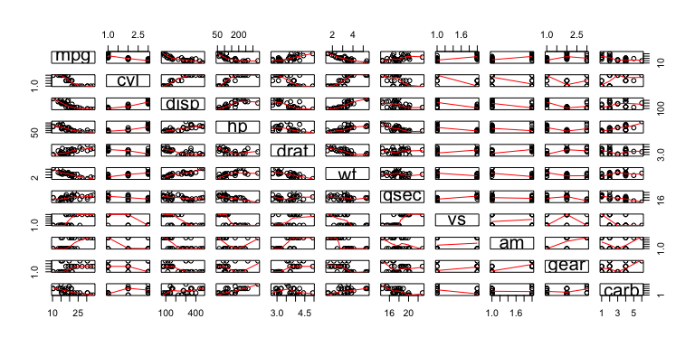
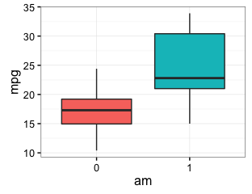
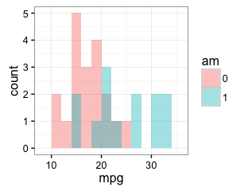
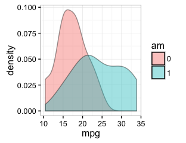
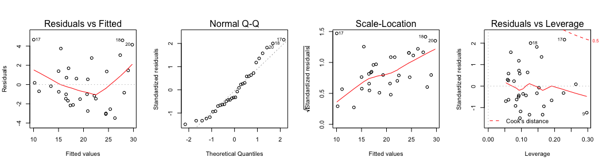
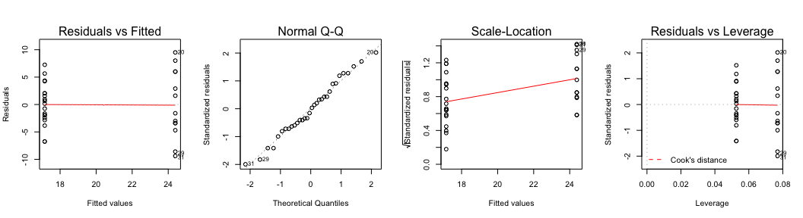
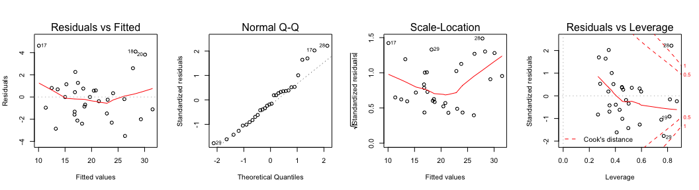

# Linear Modeling of Transmission Type vs. MPG in the Motor Trend Dataset (mtcars)

## Executive Summary

This report investigates a Motor Trend dataset (mtcars) and explores the relationship between a set of variables and miles per gallon (mpg). Exploratory data analysis and a series of linear models were developed to elucidate the influence of transmission type on mpg (transmission only model, all variables model, and reduced model). The reduced linear model (which included the effects of car weight and 1/4 mile time) demonstrated that manual transmission cars had significantly greater mpg than automatic cars. Manual transmission cars were found to have a mean increase of 2.936 mpg (0.046 to 5.826 mpg, 95% confidence interval, P < 0.05) over automatic transmission cars.

## Exploratory Data Analysis


\

Plots of Transmission Type (am, 0 = auto and 1 = manual) vs. mpg:


\

\

\
Statistics and T-Test of Transmission Type (am, 0 = auto and 1 = manual) vs. mpg:


```
## Source: local data frame [2 x 7]
## 
##       am mpg-n mpg-mean   mpg-sd mpg-median 95%-CI-Left 95%-CI-Right
##   (fctr) (int)    (dbl)    (dbl)      (dbl)       (dbl)        (dbl)
## 1      0    19 17.14737 3.833966       17.3    15.29946     18.99528
## 2      1    13 24.39231 6.166504       22.8    20.66593     28.11869
```


```
## [1] "Welch Two Sample t-test"
```

```
## [1]  3.209684 11.280194
## attr(,"conf.level")
## [1] 0.95
```

This exploratory analysis suggests that there is a significant increase in the mpg of manual cars (3.210 to 11.280 mpg, 95% confidence interval, P < 0.05) compared to automatic cars.

## Regression - Base Model 

Single variable regression model: lm(formula = mpg ~ am, data = mtcars_data)


```
##              Estimate Std. Error   t value     Pr(>|t|)
## (Intercept) 17.147368   1.124603 15.247492 1.133983e-15
## am1          7.244939   1.764422  4.106127 2.850207e-04
```

These regression results suggest that manual transmission cars have a mean increase of 7.245 mpg (3.652 to 10.848 mpg, 95% confidence interval, P < 0.05) over automatic transmission cars. These results are significant (all coefficients have P < 0.05); however, the transmission variable is likely influenced by other variables, as seen in pairs plot. Also, the adjusted R2 value is only 0.339, which means only ~33.9% of the variance is explained by this model; hence, we will now investigate the influence of other variables to improve the model. 

## Regression - Full Model 

All variables in dataset regression: lm(formula = mpg ~ ., data = mtcars_data)


These regression results suggest that manual transmission cars have a mean increase of 1.212 mpg (-5.637 to 8.062 mpg, 95% confidence interval, p > 0.05, thus not a significant difference) over automatic transmission cars. While this model has a high adjusted R2 of 0.779, all the individual coefficients, including am, have P > 0.05 (see Appendix). Hence, this model is likely including unnecessary variables. 

## Regression - Reduced Model

Reduced Model: lm(formula = mpg ~ wt + qsec + am, data = mtcars_data)

I utilized the strategy of subtracting variables one-at-a-time with the highest p values from the full regression model to produce a reduced model (-cyl -carb -gear -vs -drat -disp -hp). The goal was to achieve an adjusted R2 value of > 0.80 with all coefficients P < 0.05. Furthermore, due to the proposed questions, I assumed to include the am variable.


```
##              Estimate Std. Error   t value     Pr(>|t|)
## (Intercept)  9.617781  6.9595930  1.381946 1.779152e-01
## wt          -3.916504  0.7112016 -5.506882 6.952711e-06
## qsec         1.225886  0.2886696  4.246676 2.161737e-04
## am1          2.935837  1.4109045  2.080819 4.671551e-02
```

```
##                   2.5 %    97.5 %
## (Intercept) -4.63829946 23.873860
## wt          -5.37333423 -2.459673
## qsec         0.63457320  1.817199
## am1          0.04573031  5.825944
```

These regression results suggest that manual transmission cars have a mean increase of 2.936 mpg (0.046 to 5.826 mpg, 95% confidence interval, P < 0.05) over automatic transmission cars. This model has a high adjusted R2 of 0.834 and all coefficients (besides the intercept) have P < 0.05. Each of these variables was found to have a significant influence on mpg via the anova() function (see Appendix). 

\

These residual plots/diagnostics show that the residual values are randomly distributed and there does not appear to be any outliers that significantly influence the fit. Thus, this model is a 'good' fit. 

## Conclusions:

The reduced linear model (which included the effects of car weight and 1/4 mile time) demonstrated that manual transmission cars had significantly greater mpg than automatic cars. Manual transmission cars were found to have a mean increase of 2.936 mpg (0.046 to 5.826 mpg, 95% confidence interval, P < 0.05) over automatic transmission cars.

## APPENDIX

#### Exploratory Data Analysis


```r
## load libraries
library(dplyr); library(datasets); library(ggplot2)
data(mtcars); mtcars_data <- tbl_df(mtcars)
## define variables as factor terms 
mtcars_data$cyl <- as.factor(mtcars_data$cyl); mtcars_data$vs <- as.factor(mtcars_data$vs)
mtcars_data$am <- as.factor(mtcars_data$am); mtcars_data$gear <- as.factor(mtcars_data$gear)
mtcars_data$carb <- as.factor(mtcars_data$carb); summary(mtcars_data)
```

```
##       mpg        cyl         disp             hp             drat      
##  Min.   :10.40   4:11   Min.   : 71.1   Min.   : 52.0   Min.   :2.760  
##  1st Qu.:15.43   6: 7   1st Qu.:120.8   1st Qu.: 96.5   1st Qu.:3.080  
##  Median :19.20   8:14   Median :196.3   Median :123.0   Median :3.695  
##  Mean   :20.09          Mean   :230.7   Mean   :146.7   Mean   :3.597  
##  3rd Qu.:22.80          3rd Qu.:326.0   3rd Qu.:180.0   3rd Qu.:3.920  
##  Max.   :33.90          Max.   :472.0   Max.   :335.0   Max.   :4.930  
##        wt             qsec       vs     am     gear   carb  
##  Min.   :1.513   Min.   :14.50   0:18   0:19   3:15   1: 7  
##  1st Qu.:2.581   1st Qu.:16.89   1:14   1:13   4:12   2:10  
##  Median :3.325   Median :17.71                 5: 5   3: 3  
##  Mean   :3.217   Mean   :17.85                        4:10  
##  3rd Qu.:3.610   3rd Qu.:18.90                        6: 1  
##  Max.   :5.424   Max.   :22.90                        8: 1
```


```r
## pairs plot with smooth fit lines
pairs(mtcars_data, panel = panel.smooth)
```


```r
## exploratory data analysis - plot transmission type vs. mpg, histogram + density plots
g0 <- ggplot(mtcars_data, aes(x=am, y=mpg, fill=am)) + geom_boxplot() + theme_bw() + guides(fill=FALSE)
g1 <- ggplot(mtcars_data, aes(x=mpg, fill=am)) + geom_histogram(binwidth=2, alpha=0.4, position="identity") + theme_bw()
g2 <- ggplot(mtcars_data, aes(x=mpg, fill=am)) + geom_density(alpha=0.4) + theme_bw()
g0; g1; g2
```


```r
## statistics and t-test - transmission type vs. mpg
d <- dplyr::select(mtcars_data, am, mpg)
d_stats <- summarize(group_by(d, am), "mpg-n" = length(mpg),"mpg-mean" = mean(mpg),"mpg-sd" = sd(mpg), "mpg-median" = quantile(mpg,0.5), "95%-CI-Left" = t.test(mpg)[[4]][1], "95%-CI-Right" = t.test(mpg)[[4]][2] ); d_stats
```


```r
# t-test between mpg from auto vs. manual transmission 
t.test(data.frame(d[d$am==1,][2]), data.frame(d[d$am==0,][2]), paired=FALSE, var.equal=FALSE)
```

```
## 
## 	Welch Two Sample t-test
## 
## data:  data.frame(d[d$am == 1, ][2]) and data.frame(d[d$am == 0, ][2])
## t = 3.7671, df = 18.332, p-value = 0.001374
## alternative hypothesis: true difference in means is not equal to 0
## 95 percent confidence interval:
##   3.209684 11.280194
## sample estimates:
## mean of x mean of y 
##  24.39231  17.14737
```

#### Regression - Base Model 


```r
fit_am <- lm(mpg ~ am, mtcars_data); summary(fit_am)
```

```
## 
## Call:
## lm(formula = mpg ~ am, data = mtcars_data)
## 
## Residuals:
##     Min      1Q  Median      3Q     Max 
## -9.3923 -3.0923 -0.2974  3.2439  9.5077 
## 
## Coefficients:
##             Estimate Std. Error t value Pr(>|t|)    
## (Intercept)   17.147      1.125  15.247 1.13e-15 ***
## am1            7.245      1.764   4.106 0.000285 ***
## ---
## Signif. codes:  0 '***' 0.001 '**' 0.01 '*' 0.05 '.' 0.1 ' ' 1
## 
## Residual standard error: 4.902 on 30 degrees of freedom
## Multiple R-squared:  0.3598,	Adjusted R-squared:  0.3385 
## F-statistic: 16.86 on 1 and 30 DF,  p-value: 0.000285
```


```r
par(mfrow=c(1,4)); plot(fit_am)
```

\

#### Regression - Full Model 


```r
fit_all <- lm (mpg ~ . , mtcars_data); summary(fit_all)$coefficients
```

```
##                Estimate  Std. Error     t value   Pr(>|t|)
## (Intercept) 23.87913244 20.06582026  1.19004018 0.25252548
## cyl6        -2.64869528  3.04089041 -0.87102622 0.39746642
## cyl8        -0.33616298  7.15953951 -0.04695316 0.96317000
## disp         0.03554632  0.03189920  1.11433290 0.28267339
## hp          -0.07050683  0.03942556 -1.78835344 0.09393155
## drat         1.18283018  2.48348458  0.47627845 0.64073922
## wt          -4.52977584  2.53874584 -1.78425732 0.09461859
## qsec         0.36784482  0.93539569  0.39325050 0.69966720
## vs1          1.93085054  2.87125777  0.67247551 0.51150791
## am1          1.21211570  3.21354514  0.37718957 0.71131573
## gear4        1.11435494  3.79951726  0.29328856 0.77332027
## gear5        2.52839599  3.73635801  0.67670068 0.50889747
## carb2       -0.97935432  2.31797446 -0.42250436 0.67865093
## carb3        2.99963875  4.29354611  0.69863900 0.49546781
## carb4        1.09142288  4.44961992  0.24528452 0.80956031
## carb6        4.47756921  6.38406242  0.70136677 0.49381268
## carb8        7.25041126  8.36056638  0.86721532 0.39948495
```


```r
par(mfrow=c(1,4)); plot(fit_all)
```

\

#### Regression - Reduced Model


```r
fit_reduced <- lm (mpg ~ wt + qsec + am, mtcars_data); summary(fit_reduced); confint(fit_reduced)
```

```
## 
## Call:
## lm(formula = mpg ~ wt + qsec + am, data = mtcars_data)
## 
## Residuals:
##     Min      1Q  Median      3Q     Max 
## -3.4811 -1.5555 -0.7257  1.4110  4.6610 
## 
## Coefficients:
##             Estimate Std. Error t value Pr(>|t|)    
## (Intercept)   9.6178     6.9596   1.382 0.177915    
## wt           -3.9165     0.7112  -5.507 6.95e-06 ***
## qsec          1.2259     0.2887   4.247 0.000216 ***
## am1           2.9358     1.4109   2.081 0.046716 *  
## ---
## Signif. codes:  0 '***' 0.001 '**' 0.01 '*' 0.05 '.' 0.1 ' ' 1
## 
## Residual standard error: 2.459 on 28 degrees of freedom
## Multiple R-squared:  0.8497,	Adjusted R-squared:  0.8336 
## F-statistic: 52.75 on 3 and 28 DF,  p-value: 1.21e-11
```

```
##                   2.5 %    97.5 %
## (Intercept) -4.63829946 23.873860
## wt          -5.37333423 -2.459673
## qsec         0.63457320  1.817199
## am1          0.04573031  5.825944
```


```r
par(mfrow=c(1,4)); plot(fit_reduced)
```


```r
anova(fit_reduced)
```

```
## Analysis of Variance Table
## 
## Response: mpg
##           Df Sum Sq Mean Sq  F value    Pr(>F)    
## wt         1 847.73  847.73 140.2143 2.038e-12 ***
## qsec       1  82.86   82.86  13.7048 0.0009286 ***
## am         1  26.18   26.18   4.3298 0.0467155 *  
## Residuals 28 169.29    6.05                       
## ---
## Signif. codes:  0 '***' 0.001 '**' 0.01 '*' 0.05 '.' 0.1 ' ' 1
```
