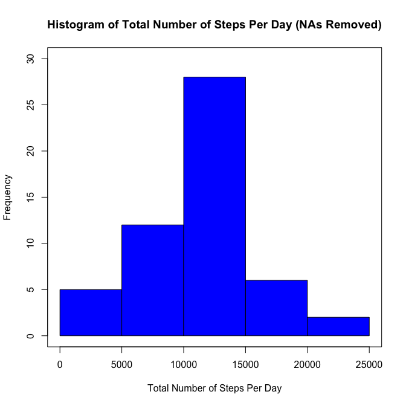
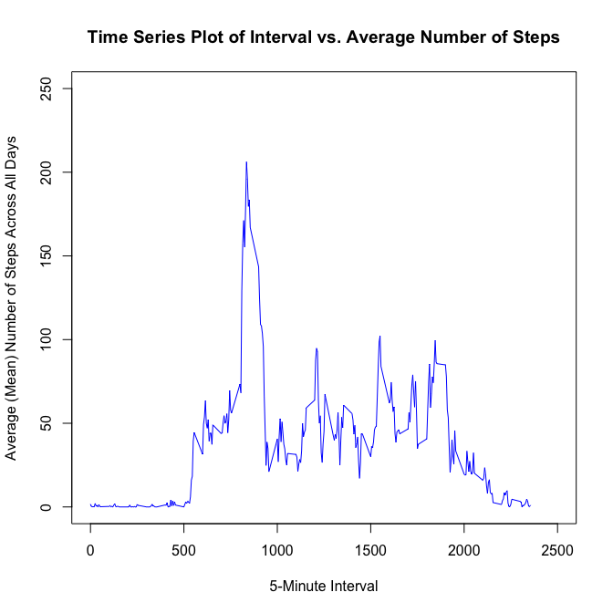
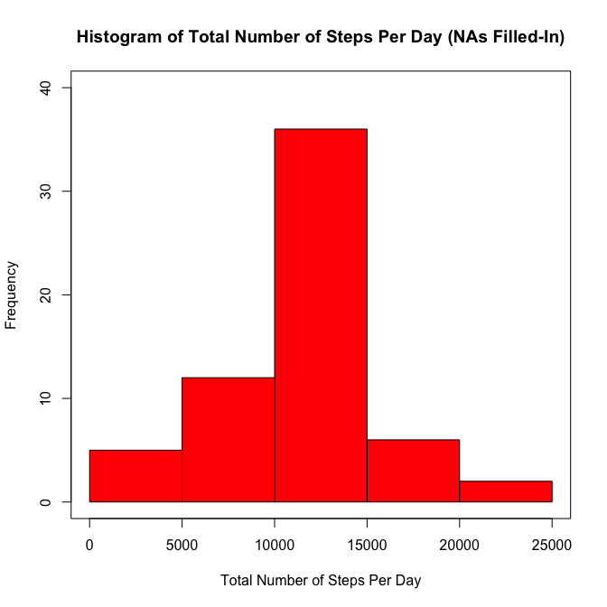
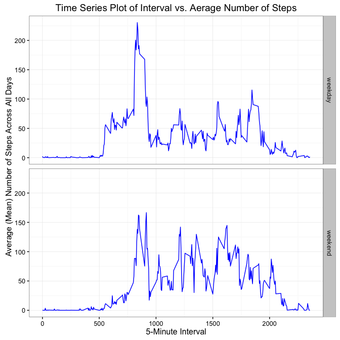

# Reproducible Research: Activity Monitoring Data

## Data

Dataset: Activity monitoring data [52K] (activity.zip)  
Source: https://d396qusza40orc.cloudfront.net/repdata%2Fdata%2Factivity.zip  

NOTE: activity.zip dataset extracted to ./data/activity.csv

The dataset is stored in a comma-separated-value (CSV) file and there are a total of 17,568 observations in this dataset.

The variables included in this dataset are:  

* steps: Number of steps taking in a 5-minute interval (missing values are coded as NA)  
* date: The date on which the measurement was taken in YYYY-MM-DD format  
* interval: Identifier for the 5-minute interval in which measurement was taken   

## Loading and preprocessing the data

1. Load the data (i.e. read.csv())  

2. Process/transform the data (if necessary) into a format suitable for your analysis


```r
## load plyr/dplyr libraries to work with data
library(dplyr)
```

```
## 
## Attaching package: 'dplyr'
```

```
## The following objects are masked from 'package:stats':
## 
##     filter, lag
```

```
## The following objects are masked from 'package:base':
## 
##     intersect, setdiff, setequal, union
```

```r
## read data 
## NOTE: activity.zip dataset extracted to ./data/activity.csv
cols = c("numeric","character","numeric")
activity_data <- read.csv("./data/activity.csv", 
                              header = TRUE,
                              na.strings = "NA",
                              colClasses = cols)

str(activity_data)
```

```
## 'data.frame':	17568 obs. of  3 variables:
##  $ steps   : num  NA NA NA NA NA NA NA NA NA NA ...
##  $ date    : chr  "2012-10-01" "2012-10-01" "2012-10-01" "2012-10-01" ...
##  $ interval: num  0 5 10 15 20 25 30 35 40 45 ...
```

## What is mean total number of steps taken per day?

NOTE: NA values ignored

1. Make a histogram of the total number of steps taken each day  


```r
## remove NAs from data 
activity_removena <-  na.omit(activity_data)

## convert to data frame table objet
activity_removena_tbl <- tbl_df(activity_removena)
str(activity_removena_tbl)
```

```
## Classes 'tbl_df', 'tbl' and 'data.frame':	15264 obs. of  3 variables:
##  $ steps   : num  0 0 0 0 0 0 0 0 0 0 ...
##  $ date    : chr  "2012-10-02" "2012-10-02" "2012-10-02" "2012-10-02" ...
##  $ interval: num  0 5 10 15 20 25 30 35 40 45 ...
##  - attr(*, "na.action")=Class 'omit'  Named int [1:2304] 1 2 3 4 5 6 7 8 9 10 ...
##   .. ..- attr(*, "names")= chr [1:2304] "1" "2" "3" "4" ...
```

```r
## group by date and then sum steps
by_date <- group_by(activity_removena_tbl, date)
activity_removena_date_steps <- summarize(by_date, 
                                          "total.steps" = sum(steps),
                                          "mean.steps" = mean(steps),
                                          "median.steps" = median(steps))
str(activity_removena_date_steps)
```

```
## Classes 'tbl_df', 'tbl' and 'data.frame':	53 obs. of  4 variables:
##  $ date        : chr  "2012-10-02" "2012-10-03" "2012-10-04" "2012-10-05" ...
##  $ total.steps : num  126 11352 12116 13294 15420 ...
##  $ mean.steps  : num  0.438 39.417 42.069 46.16 53.542 ...
##  $ median.steps: num  0 0 0 0 0 0 0 0 0 0 ...
##  - attr(*, "na.action")=Class 'omit'  Named int [1:2304] 1 2 3 4 5 6 7 8 9 10 ...
##   .. ..- attr(*, "names")= chr [1:2304] "1" "2" "3" "4" ...
```

```r
## print histogram of total number of steps per day
hist(activity_removena_date_steps$total.steps,
     col = "blue",
     xlab = "Total Number of Steps Per Day",
     main = "Histogram of Total Number of Steps Per Day (NAs Removed)",
     xlim = c(0,25000),
     ylim = c(0,30),
     axes = TRUE)
box()
```

\

2. Calculate and report the mean and median total number of steps taken per day


```r
## print summary of total numbers of steps
summary(activity_removena_date_steps$total.steps)
```

```
##    Min. 1st Qu.  Median    Mean 3rd Qu.    Max. 
##      41    8841   10760   10770   13290   21190
```

```r
## report the mean and medium total number of steps per day
print(paste("Mean:",
            mean(activity_removena_date_steps$total.steps)))
```

```
## [1] "Mean: 10766.1886792453"
```

```r
print(paste("Median:",
            median(activity_removena_date_steps$total.steps)))
```

```
## [1] "Median: 10765"
```

**The mean total number of steps taken per day is: 1.0766189\times 10^{4} and the median total number of steps taken per day is: 1.0765\times 10^{4}**  

## What is the average daily activity pattern?

1. Make a time series plot (i.e. type = "l") of the 5-minute interval (x-axis) and the average number of steps taken, averaged across all days (y-axis)  


```r
## group by interval and then average (mean) steps
by_interval <- group_by(activity_removena_tbl, interval)
activity_removena_interval_steps <- summarize(by_interval, 
                                          "average.steps" = mean(steps))
str(activity_removena_interval_steps)
```

```
## Classes 'tbl_df', 'tbl' and 'data.frame':	288 obs. of  2 variables:
##  $ interval     : num  0 5 10 15 20 25 30 35 40 45 ...
##  $ average.steps: num  1.717 0.3396 0.1321 0.1509 0.0755 ...
##  - attr(*, "na.action")=Class 'omit'  Named int [1:2304] 1 2 3 4 5 6 7 8 9 10 ...
##   .. ..- attr(*, "names")= chr [1:2304] "1" "2" "3" "4" ...
```

```r
## make time series plot (type = "l") of interval (x-axis) vs. average steps across all days (y-axis)
plot(activity_removena_interval_steps$interval, 
     activity_removena_interval_steps$average.steps,
     type = "l",
     main = "Time Series Plot of Interval vs. Average Number of Steps",
     xlab = "5-Minute Interval",
     ylab = "Average (Mean) Number of Steps Across All Days",
     col = "blue",
     xlim = c(0,2500),
     ylim = c(0,250))
```

\

2. Which 5-minute interval, on average across all the days in the dataset, contains the maximum number of steps?


```r
## report interval with max average steps
print(paste("Interval:", 
      activity_removena_interval_steps[which.max(activity_removena_interval_steps$average.steps),1]))
```

```
## [1] "Interval: 835"
```

```r
print(paste("Max Steps:", 
      activity_removena_interval_steps[which.max(activity_removena_interval_steps$average.steps),2]))
```

```
## [1] "Max Steps: 206.169811320755"
```

**The 835 5-minute interval, on average across all days, contains the max number of steps (206.1698113)**

## Imputing missing values

1. Calculate and report the total number of missing values in the dataset (i.e. the total number of rows with NAs)


```r
## count and remport number of NA values
print(paste("NAs:", sum(is.na(activity_data))))
```

```
## [1] "NAs: 2304"
```

**Total number of missing values in dataset is: 2304**

2. Devise a strategy for filling in all of the missing values in the dataset. The strategy does not need to be sophisticated. For example, you could use the mean/median for that day, or the mean for that 5-minute interval, etc.

**STRATEGY: Replaced NA values with average/mean for that 5-min interval across all days (previously calculated above)**

3. Create a new dataset that is equal to the original dataset but with the missing data filled in.


```r
## convert data to data frame table object
activity_tbl_replaceNA <- tbl_df(activity_data)
str(activity_tbl_replaceNA)
```

```
## Classes 'tbl_df', 'tbl' and 'data.frame':	17568 obs. of  3 variables:
##  $ steps   : num  NA NA NA NA NA NA NA NA NA NA ...
##  $ date    : chr  "2012-10-01" "2012-10-01" "2012-10-01" "2012-10-01" ...
##  $ interval: num  0 5 10 15 20 25 30 35 40 45 ...
```

```r
## loop over each row of activity data
for (i in 1:17568) {
     ## check if step value is NA
     if (is.na(activity_tbl_replaceNA[i,1])) {
        ## if NA, replace NA with average steps from interval across all days (calculated above)
        interval2 <- activity_tbl_replaceNA[i,3]
        newval <- filter(activity_removena_interval_steps, interval == as.numeric(interval2))[2]
        activity_tbl_replaceNA[i,1] <- newval
     }
}

## new data set with filled-in NA values is the "activity_tbl_replaceNA" data frame table object
str(activity_tbl_replaceNA)
```

```
## Classes 'tbl_df', 'tbl' and 'data.frame':	17568 obs. of  3 variables:
##  $ steps   : num  1.717 0.3396 0.1321 0.1509 0.0755 ...
##  $ date    : chr  "2012-10-01" "2012-10-01" "2012-10-01" "2012-10-01" ...
##  $ interval: num  0 5 10 15 20 25 30 35 40 45 ...
```

4. Make a histogram of the total number of steps taken each day and Calculate and report the mean and median total number of steps taken per day. Do these values differ from the estimates from the first part of the assignment? What is the impact of imputing missing data on the estimates of the total daily number of steps?


```r
## group by date and then sum steps
by_date_replaceNA <- group_by(activity_tbl_replaceNA, date)
activity_tbl_replaceNA_steps <- summarize(by_date_replaceNA, 
                                          "total.steps" = sum(steps),
                                          "mean.steps" = mean(steps),
                                          "median.steps" = median(steps))
str(activity_tbl_replaceNA_steps)
```

```
## Classes 'tbl_df', 'tbl' and 'data.frame':	61 obs. of  4 variables:
##  $ date        : chr  "2012-10-01" "2012-10-02" "2012-10-03" "2012-10-04" ...
##  $ total.steps : num  10766 126 11352 12116 13294 ...
##  $ mean.steps  : num  37.383 0.438 39.417 42.069 46.16 ...
##  $ median.steps: num  34.1 0 0 0 0 ...
```

```r
## print histogram of total number of steps per day
hist(activity_tbl_replaceNA_steps$total.steps,
     col = "red",
     xlab = "Total Number of Steps Per Day",
     main = "Histogram of Total Number of Steps Per Day (NAs Filled-In)",
     xlim = c(0,25000),
     ylim = c(0,40),
     axes = TRUE)
box()
```

\

**These shape of the histogram with NAs filled-in is consistent when the previous histogram with NAs removed; however, the frequency values for the middle group has increased.**


```r
## print summary of total numbers of steps
summary(activity_tbl_replaceNA_steps$total.steps)
```

```
##    Min. 1st Qu.  Median    Mean 3rd Qu.    Max. 
##      41    9819   10770   10770   12810   21190
```

```r
## report the mean and medium total number of steps per day
print(paste("Mean:",
            mean(activity_tbl_replaceNA_steps$total.steps)))
```

```
## [1] "Mean: 10766.1886792453"
```

```r
print(paste("Median:",
            median(activity_tbl_replaceNA_steps$total.steps)))
```

```
## [1] "Median: 10766.1886792453"
```

**The mean total number of steps taken per day is: 1.0766189\times 10^{4} and the median total number of steps taken per day is: 1.0766189\times 10^{4}**

**The mean total number of steps taken per day did not change betwwen NA values being removed vs. filled-in. The median total number of steps slightly increased betwwen NA vlues being removed vs. filled-in.**

## Are there differences in activity patterns between weekdays and weekends?

1. Create a new factor variable in the dataset with two levels – “weekday” and “weekend” indicating whether a given date is a weekday or weekend day.


```r
## make copy of dataset to modify 
activity_tbl_replaceNA_weekdays <- activity_tbl_replaceNA
str(activity_tbl_replaceNA_weekdays)
```

```
## Classes 'tbl_df', 'tbl' and 'data.frame':	17568 obs. of  3 variables:
##  $ steps   : num  1.717 0.3396 0.1321 0.1509 0.0755 ...
##  $ date    : chr  "2012-10-01" "2012-10-01" "2012-10-01" "2012-10-01" ...
##  $ interval: num  0 5 10 15 20 25 30 35 40 45 ...
```

```r
## convert date column (character) to date object POSIXlt/POSIXct
activity_tbl_replaceNA_weekdays$date <- strptime(activity_tbl_replaceNA_weekdays$date,
                                                  format="%Y-%m-%d")

## add a column with the name of the day of the week
activity_tbl_replaceNA_weekdays$day <- weekdays(activity_tbl_replaceNA_weekdays$date) 

## define date names and weekday/weekend classification
date_types <- data.frame("day" = c("Monday","Tuesday","Wednesday","Thursday","Friday","Saturday","Sunday"),"day.type" = c("weekday","weekday","weekday","weekday","weekday","weekend","weekend"))
date_types$day <- as.character(date_types$day)

## add "weekday" and "weekend" factor column by join-ing tables
activity_tbl_replaceNA_weekdays_weekends <- plyr::join(activity_tbl_replaceNA_weekdays, 
                                                   date_types, 
                                                   by = 'day')

## "activity_tbl_replaceNA_weekdays_weekends" is the new dataset with weekend/weekday column
## join function outputs data.frame, use tbl_df to convert back to data frame table object
activity_tbl_replaceNA_weekdays_weekends <- tbl_df(activity_tbl_replaceNA_weekdays_weekends)
str(activity_tbl_replaceNA_weekdays_weekends)
```

```
## Classes 'tbl_df', 'tbl' and 'data.frame':	17568 obs. of  5 variables:
##  $ steps   : num  1.717 0.3396 0.1321 0.1509 0.0755 ...
##  $ date    : POSIXlt, format: "2012-10-01" "2012-10-01" ...
##  $ interval: num  0 5 10 15 20 25 30 35 40 45 ...
##  $ day     : chr  "Monday" "Monday" "Monday" "Monday" ...
##  $ day.type: Factor w/ 2 levels "weekday","weekend": 1 1 1 1 1 1 1 1 1 1 ...
```

2. Make a panel plot containing a time series plot (i.e. type = "l") of the 5-minute interval (x-axis) and the average number of steps taken, averaged across all weekday days or weekend days (y-axis). The plot should look something like the following, which was creating using simulated data:


```r
## convert date column back to character values because dplyr function do not work well with POSIXlt
## R crashes if dplyr function used on a data frame table containing POSIXlt column
activity_tbl_replaceNA_weekdays_weekends$date <- as.character(activity_tbl_replaceNA_weekdays_weekends$date)

## group data by interval and day.type, then average (mean) steps
by_interval_daytype <- group_by(activity_tbl_replaceNA_weekdays_weekends, interval, day.type)
activity_tbl_replaceNA_weekdays_weekends_interval_average_steps <- summarize(by_interval_daytype, 
                                          "average.steps" = mean(steps))
str(activity_tbl_replaceNA_weekdays_weekends_interval_average_steps)
```

```
## Classes 'grouped_df', 'tbl_df', 'tbl' and 'data.frame':	576 obs. of  3 variables:
##  $ interval     : num  0 0 5 5 10 10 15 15 20 20 ...
##  $ day.type     : Factor w/ 2 levels "weekday","weekend": 1 2 1 2 1 2 1 2 1 2 ...
##  $ average.steps: num  2.2512 0.2146 0.4453 0.0425 0.1732 ...
##  - attr(*, "vars")=List of 1
##   ..$ : symbol interval
##  - attr(*, "drop")= logi TRUE
```

```r
## make a ggplot compairing weekend vs. weekday average steps (y-axis) vs. interval (x-axis)
## base ggplot plot
library(ggplot2)
g <- ggplot(activity_tbl_replaceNA_weekdays_weekends_interval_average_steps, 
            aes(x=interval, y=average.steps))
## add layers
g2 <- g + geom_line(col = "blue") + 
          facet_grid(day.type ~ .) +
          labs(x = "5-Minute Interval") +
          labs(y = "Average (Mean) Number of Steps Across All Days") +
          labs(title = "Time Series Plot of Interval vs. Aerage Number of Steps") +
          theme_bw()
# display plot
g2
```

\

**Yes, the activity pattern between weekdays and weekends are different.**
