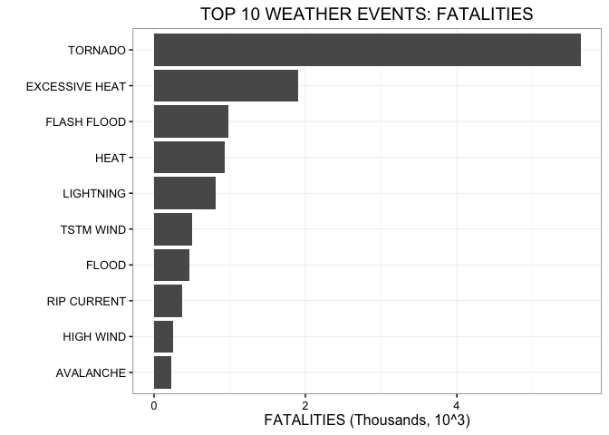
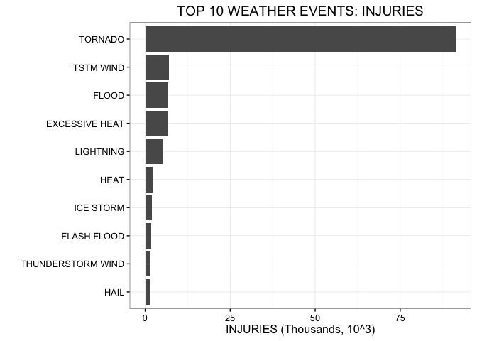
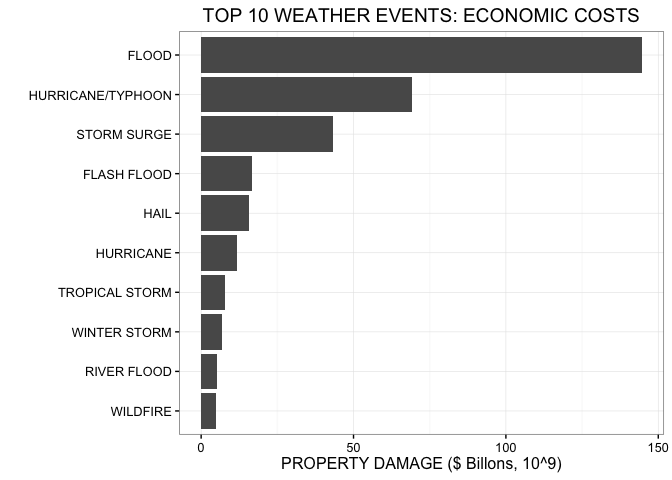
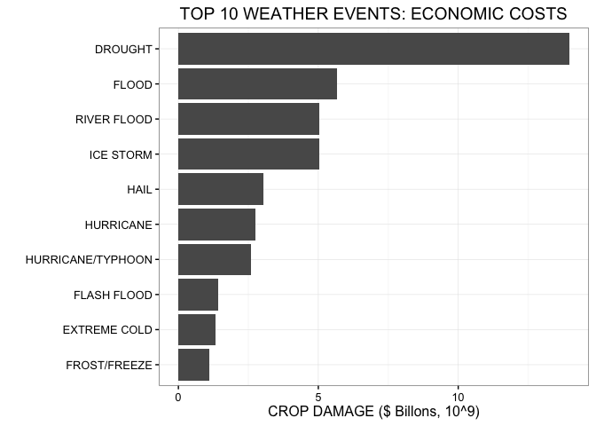
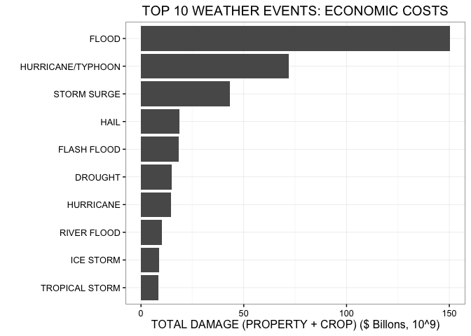

# Severe Weather Events with Greatest Fatalities, Injuries, and Economic Damage in the United States 1950-2011

## Synopsis

Severe weather data (Source: NOAA) from 1950 to 2011 were analyzed to determine the weather events that cause the greatest population harm (fatalities and injuries) and economic damage (property and crop). The top 5 fatality causing events were TORNADO (5633), EXCESSIVE HEAT (1903), FLASH FLOOD (978), HEAT (937), and LIGHTNING (816). The top 5 injury causing events were TORNADO (91346), TSTM WIND (6957), FLOOD (6789), EXCESSIVE HEAT (6525), and LIGHTNING (5230). The top 5 property damage causing events were FLOOD ($1.447e+11), HURRICANE/TYPHOON ($6.931e+10), STORM SURGE ($4.332e+10), FLASH FLOOD ($1.682e+10), and HAIL ($1.574e+10). The top 5 crop damage causing events were DROUGHT ($1.397e+10), FLOOD ($5.662e+09), RIVER FLOOD ($5.029e+09), ICE STORM ($5.022e+09), and HAIL ($3.026e+09). Conclusions: (1) For greatest population health impact, future work/research/preparedness/aid should focus on Tornados (2) For greatest economic impact, future work/research/preparedness/aid should focus on Floods and Droughts. 

## Introduction

Storms and other severe weather events can cause both public health and economic problems for communities and municipalities. Many severe events can result in fatalities, injuries, and property damage, and preventing such outcomes to the extent possible is a key concern.

This project involves exploring the U.S. National Oceanic and Atmospheric Administration's (NOAA) storm database. This database tracks characteristics of major storms and weather events in the United States, including when and where they occur, as well as estimates of any fatalities, injuries, and property damage.

## Methods

Analysis was preformed on:

* R: 3.1.1 
* Rstuido: Version 0.98.1073 
* Operating System: Mac OS X 10.9.5 
* Hardware: Macbook Pro, 2.2 ghz Intel Core 2 Duo, 3 GB RAM 

NOAA Storm Data Source: https://d396qusza40orc.cloudfront.net/repdata%2Fdata%2FStormData.csv.bz2

The data for this assignment come in the form of a comma-separated-value file compressed via the bzip2 algorithm to reduce its size. You can download the file from the course web site:

The events in the database start in the year 1950 and end in November 2011. In the earlier years of the database there are generally fewer events recorded, most likely due to a lack of good records. More recent years should be considered more complete.

## Data Processing 

Loaded libraries. Dplyr was used to sort/analyze dataset. 


```r
## load libraries --------------------------------------------------------------------------

library(stringr)
library(dplyr)
```

```
## 
## Attaching package: 'dplyr'
```

```
## The following objects are masked from 'package:stats':
## 
##     filter, lag
```

```
## The following objects are masked from 'package:base':
## 
##     intersect, setdiff, setequal, union
```

Loaded data and then made transformations (capitalized and removed whitespace) to clean up the inconsistencies/errors in the dataset. 


```r
## load data -------------------------------------------------------------------------------

data_extracted <- bzfile("repdata-data-StormData.csv.bz2")
storm_data <- read.csv(data_extracted, header = TRUE)

## data transformations --------------------------------------------------------------------

## capitalize column data to be consistant and remove whitespace to clean up data
storm_data$EVTYPE <- sapply(storm_data$EVTYPE, toupper)
storm_data$EVTYPE <- str_trim(storm_data$EVTYPE)
storm_data$PROPDMGEXP <- sapply(storm_data$PROPDMGEXP, toupper)
storm_data$CROPDMGEXP <- sapply(storm_data$CROPDMGEXP, toupper)

## convert to table data frame
storm_data_tbl <- tbl_df(storm_data)

## print dataset
storm_data_tbl
```

```
## Source: local data frame [902,297 x 37]
## 
##    STATE__           BGN_DATE BGN_TIME TIME_ZONE COUNTY COUNTYNAME  STATE
##      (dbl)             (fctr)   (fctr)    (fctr)  (dbl)     (fctr) (fctr)
## 1        1  4/18/1950 0:00:00     0130       CST     97     MOBILE     AL
## 2        1  4/18/1950 0:00:00     0145       CST      3    BALDWIN     AL
## 3        1  2/20/1951 0:00:00     1600       CST     57    FAYETTE     AL
## 4        1   6/8/1951 0:00:00     0900       CST     89    MADISON     AL
## 5        1 11/15/1951 0:00:00     1500       CST     43    CULLMAN     AL
## 6        1 11/15/1951 0:00:00     2000       CST     77 LAUDERDALE     AL
## 7        1 11/16/1951 0:00:00     0100       CST      9     BLOUNT     AL
## 8        1  1/22/1952 0:00:00     0900       CST    123 TALLAPOOSA     AL
## 9        1  2/13/1952 0:00:00     2000       CST    125 TUSCALOOSA     AL
## 10       1  2/13/1952 0:00:00     2000       CST     57    FAYETTE     AL
## ..     ...                ...      ...       ...    ...        ...    ...
## Variables not shown: EVTYPE (chr), BGN_RANGE (dbl), BGN_AZI (fctr),
##   BGN_LOCATI (fctr), END_DATE (fctr), END_TIME (fctr), COUNTY_END (dbl),
##   COUNTYENDN (lgl), END_RANGE (dbl), END_AZI (fctr), END_LOCATI (fctr),
##   LENGTH (dbl), WIDTH (dbl), F (int), MAG (dbl), FATALITIES (dbl),
##   INJURIES (dbl), PROPDMG (dbl), PROPDMGEXP (chr), CROPDMG (dbl),
##   CROPDMGEXP (chr), WFO (fctr), STATEOFFIC (fctr), ZONENAMES (fctr),
##   LATITUDE (dbl), LONGITUDE (dbl), LATITUDE_E (dbl), LONGITUDE_ (dbl),
##   REMARKS (fctr), REFNUM (dbl)
```

Sorted data by weather event and summed the number of fatalities and injuries. Ordered the data from highest to lowest. 


```r
## Fatalities and Injuries ----------------------------------------------------------

## group by weather type, EVTYPE
by_EVTYPE <- group_by(storm_data_tbl, EVTYPE)

## sum fatalities and injuries by EVTYPE
tbl_FAT <- summarize(by_EVTYPE, 
                     "TOTAL.FATALITIES" = sum(FATALITIES))
tbl_INJ <- summarize(by_EVTYPE, 
                     "TOTAL.INJURIES" = sum(INJURIES))

## arrange data in decending order
tbl_FAT_order <- arrange(tbl_FAT, 
                         desc(TOTAL.FATALITIES))
tbl_INJ_order <- arrange(tbl_INJ, 
                         desc(TOTAL.INJURIES))

## print datasets
tbl_FAT_order
```

```
## Source: local data frame [890 x 2]
## 
##            EVTYPE TOTAL.FATALITIES
##             (chr)            (dbl)
## 1         TORNADO             5633
## 2  EXCESSIVE HEAT             1903
## 3     FLASH FLOOD              978
## 4            HEAT              937
## 5       LIGHTNING              816
## 6       TSTM WIND              504
## 7           FLOOD              470
## 8     RIP CURRENT              368
## 9       HIGH WIND              248
## 10      AVALANCHE              224
## ..            ...              ...
```

```r
tbl_INJ_order 
```

```
## Source: local data frame [890 x 2]
## 
##               EVTYPE TOTAL.INJURIES
##                (chr)          (dbl)
## 1            TORNADO          91346
## 2          TSTM WIND           6957
## 3              FLOOD           6789
## 4     EXCESSIVE HEAT           6525
## 5          LIGHTNING           5230
## 6               HEAT           2100
## 7          ICE STORM           1975
## 8        FLASH FLOOD           1777
## 9  THUNDERSTORM WIND           1488
## 10              HAIL           1361
## ..               ...            ...
```

Sorted data by weather event and summed the number of property and crop damage. Selected values greater than zero and transformed property/crop damage values to account for exponent value in order to correctly sum damage data. Ordered the data from highest to lowest. 


```r
## Economic Damage -------------------------------------------------------------------------

## filter property damage OR crop damage values greater than 0
storm_data_tbl_econ <- filter(storm_data_tbl, PROPDMG > 0 | CROPDMG > 0)

## *** Replace exp abbreviation column with numerical values ***
## H-hundreds, M-millions, B-billions, K-thousands
## 0-9 was treated as power of 10, 10^X 
## -,+,? characters were ignored due to unknown values, changed to NA value
## blank value was treated as 10^0 = 1

## property damage exp column
storm_data_tbl_econ$PROPDMGEXP[ storm_data_tbl_econ$PROPDMGEXP  == "H" ] <- 100
storm_data_tbl_econ$PROPDMGEXP[ storm_data_tbl_econ$PROPDMGEXP  == "K" ] <- 1000 
storm_data_tbl_econ$PROPDMGEXP[ storm_data_tbl_econ$PROPDMGEXP  == "M" ] <- 1000000 
storm_data_tbl_econ$PROPDMGEXP[ storm_data_tbl_econ$PROPDMGEXP  == "B" ] <- 1000000000 
storm_data_tbl_econ$PROPDMGEXP[ storm_data_tbl_econ$PROPDMGEXP  == "2" ] <- 100 
storm_data_tbl_econ$PROPDMGEXP[ storm_data_tbl_econ$PROPDMGEXP  == "3" ] <- 1000
storm_data_tbl_econ$PROPDMGEXP[ storm_data_tbl_econ$PROPDMGEXP  == "4" ] <- 10000
storm_data_tbl_econ$PROPDMGEXP[ storm_data_tbl_econ$PROPDMGEXP  == "5" ] <- 100000
storm_data_tbl_econ$PROPDMGEXP[ storm_data_tbl_econ$PROPDMGEXP  == "6" ] <- 1000000 
storm_data_tbl_econ$PROPDMGEXP[ storm_data_tbl_econ$PROPDMGEXP  == "7" ] <- 10000000 
storm_data_tbl_econ$PROPDMGEXP[ storm_data_tbl_econ$PROPDMGEXP  == "8" ] <- 100000000 
storm_data_tbl_econ$PROPDMGEXP[ storm_data_tbl_econ$PROPDMGEXP  == "9" ] <- 1000000000 
storm_data_tbl_econ$PROPDMGEXP[ storm_data_tbl_econ$PROPDMGEXP  == "0" ] <- 1
storm_data_tbl_econ$PROPDMGEXP[ storm_data_tbl_econ$PROPDMGEXP  == "" ] <- 1
storm_data_tbl_econ$PROPDMGEXP[ storm_data_tbl_econ$PROPDMGEXP  == "-" ] <- NA
storm_data_tbl_econ$PROPDMGEXP[ storm_data_tbl_econ$PROPDMGEXP  == "+" ] <- NA

## crop damage exp column
storm_data_tbl_econ$CROPDMGEXP[ storm_data_tbl_econ$CROPDMGEXP  == "H" ] <- 100
storm_data_tbl_econ$CROPDMGEXP[ storm_data_tbl_econ$CROPDMGEXP  == "K" ] <- 1000 
storm_data_tbl_econ$CROPDMGEXP[ storm_data_tbl_econ$CROPDMGEXP  == "M" ] <- 1000000 
storm_data_tbl_econ$CROPDMGEXP[ storm_data_tbl_econ$CROPDMGEXP  == "B" ] <- 1000000000 
storm_data_tbl_econ$CROPDMGEXP[ storm_data_tbl_econ$CROPDMGEXP  == "0" ] <- 1
storm_data_tbl_econ$CROPDMGEXP[ storm_data_tbl_econ$CROPDMGEXP  == "" ] <- 1
storm_data_tbl_econ$CROPDMGEXP[ storm_data_tbl_econ$CROPDMGEXP  == "?" ] <- NA

## group by weather type, EVTYPE 
by_EVTYPE_econ <- group_by(storm_data_tbl_econ, EVTYPE)

## sum property and crop damage, seperate and combined
tbl_econ_PROPDMG <- summarize(by_EVTYPE_econ, 
                     "TOTAL.PROPDMG" = sum(PROPDMG*as.numeric(PROPDMGEXP)))
tbl_econ_CROPDMG <- summarize(by_EVTYPE_econ, 
                     "TOTAL.CROPDMG" = sum(CROPDMG*as.numeric(CROPDMGEXP)))
tbl_econ_TOTAL <- summarize(by_EVTYPE_econ, 
                     "TOTAL.DAMAGE" = sum(PROPDMG*as.numeric(PROPDMGEXP) + CROPDMG*as.numeric(CROPDMGEXP)) ) 

## arrange data in decending order
tbl_econ_PROPDMG_order <- arrange(tbl_econ_PROPDMG, 
                         desc(TOTAL.PROPDMG))
tbl_econ_CROPDMG_order <- arrange(tbl_econ_CROPDMG, 
                         desc(TOTAL.CROPDMG))
tbl_econ_TOTAL_order <- arrange(tbl_econ_TOTAL, 
                         desc(TOTAL.DAMAGE))

## print datasets
tbl_econ_PROPDMG_order
```

```
## Source: local data frame [394 x 2]
## 
##               EVTYPE TOTAL.PROPDMG
##                (chr)         (dbl)
## 1              FLOOD  144657709807
## 2  HURRICANE/TYPHOON   69305840000
## 3        STORM SURGE   43323536000
## 4        FLASH FLOOD   16822723978
## 5               HAIL   15735267513
## 6          HURRICANE   11868319010
## 7     TROPICAL STORM    7703890550
## 8       WINTER STORM    6688497251
## 9        RIVER FLOOD    5118945500
## 10          WILDFIRE    4765114000
## ..               ...           ...
```

```r
tbl_econ_CROPDMG_order
```

```
## Source: local data frame [394 x 2]
## 
##               EVTYPE TOTAL.CROPDMG
##                (chr)         (dbl)
## 1            DROUGHT   13972566000
## 2              FLOOD    5661968450
## 3        RIVER FLOOD    5029459000
## 4          ICE STORM    5022113500
## 5               HAIL    3025954473
## 6          HURRICANE    2741910000
## 7  HURRICANE/TYPHOON    2607872800
## 8        FLASH FLOOD    1421317100
## 9       EXTREME COLD    1312973000
## 10      FROST/FREEZE    1094186000
## ..               ...           ...
```

```r
tbl_econ_TOTAL_order
```

```
## Source: local data frame [394 x 2]
## 
##               EVTYPE TOTAL.DAMAGE
##                (chr)        (dbl)
## 1              FLOOD 150319678257
## 2  HURRICANE/TYPHOON  71913712800
## 3        STORM SURGE  43323541000
## 4               HAIL  18761221986
## 5        FLASH FLOOD  18244041078
## 6            DROUGHT  15018672000
## 7          HURRICANE  14610229010
## 8        RIVER FLOOD  10148404500
## 9          ICE STORM   8967041360
## 10    TROPICAL STORM   8382236550
## ..               ...          ...
```

## Results 

***Across the United States, which types of events (as indicated in the EVTYPE variable) are most harmful with respect to population health?***


```r
## make plot weather event vs. fatalities and injuries, 
library(ggplot2)

## first panel - fatalities 
plot1 <- ggplot(tbl_FAT_order[1:10,], aes(y=(TOTAL.FATALITIES/10^3), x=reorder(EVTYPE, TOTAL.FATALITIES))) + geom_bar(stat="identity") + coord_flip() + theme_bw() + labs(title = "TOP 10 WEATHER EVENTS: FATALITIES", x = "", y = "FATALITIES (Thousands, 10^3)")
plot1
```

\

```r
## second panel - injuries
plot2 <- ggplot(tbl_INJ_order[1:10,], aes(y=(TOTAL.INJURIES/10^3), x=reorder(EVTYPE, TOTAL.INJURIES))) + geom_bar(stat="identity") + coord_flip() + theme_bw() + labs(title = "TOP 10 WEATHER EVENTS: INJURIES", x = "", y = "INJURIES (Thousands, 10^3)")
plot2
```

\

FIGURE 1: TOP 10 WEATHER EVENTS: FATALITIES AND INJURIES. (A) The top 5 fatality-causing events were TORNADO (5633), EXCESSIVE HEAT (1903), FLASH FLOOD (978), HEAT (937), and LIGHTNING (816). (B) The top 5 injury-causing events were TORNADO (91346), TSTM WIND (6957), FLOOD (6789), EXCESSIVE HEAT (6525), and LIGHTNING (5230). Tornados were the top of both categories by a significant margin.  
  
CONCLUSION: For greatest population health impact, future work/research/preparedness/aid should focus on Tornados. 
  
***Across the United States, which types of events have the greatest economic consequences?***  


```r
## make plot weather event vs. damage, 3 panel plot ------------

## first panel - property damange 
plot3 <- ggplot(tbl_econ_PROPDMG_order[1:10,], aes(y=(TOTAL.PROPDMG/10^9), x=reorder(EVTYPE, TOTAL.PROPDMG))) + geom_bar(stat="identity") + coord_flip() + theme_bw() + labs(title = "TOP 10 WEATHER EVENTS: ECONOMIC COSTS", x = "", y = "PROPERTY DAMAGE ($ Billons, 10^9)")
plot3
```

\

```r
## second panel - crop damage
plot4 <- ggplot(tbl_econ_CROPDMG_order[1:10,], aes(y=(TOTAL.CROPDMG/10^9), x=reorder(EVTYPE, TOTAL.CROPDMG))) + geom_bar(stat="identity") + coord_flip() + theme_bw() + labs(title = "TOP 10 WEATHER EVENTS: ECONOMIC COSTS", x = "", y = "CROP DAMAGE ($ Billons, 10^9)")
plot4
```

\

```r
## third panel - total damage (PROPERTY + CROP)
plot5 <- ggplot(tbl_econ_TOTAL_order[1:10,], aes(y=(TOTAL.DAMAGE/10^9), x=reorder(EVTYPE, TOTAL.DAMAGE))) + geom_bar(stat="identity") + coord_flip() + theme_bw() + labs(title = "TOP 10 WEATHER EVENTS: ECONOMIC COSTS", x = "", y = "TOTAL DAMAGE (PROPERTY + CROP) ($ Billons, 10^9)")
plot5
```

\

FIGURE 2: TOP 10 WEATHER EVENTS: ECONOMIC COSTS. (A) The top 5 property damage causing events were FLOOD ($1.447e+11), HURRICANE/TYPHOON ($6.931e+10), STORM SURGE ($4.332e+10), FLASH FLOOD ($1.682e+10), and HAIL ($1.574e+10). (B) The top 5 crop damage causing events were DROUGHT ($1.397e+10), FLOOD ($5.662e+09), RIVER FLOOD ($5.029e+09), ICE STORM ($5.022e+09), and HAIL ($3.026e+09). (C) Total damage (property + crop). Floods and droughts were the top events by significant margins; however, the magnitude of property damage was significantly greater than crop damage. 

CONCLUSION: For greatest economic impact, future work/research/preparedness/aid should focus on Floods and Droughts. 
