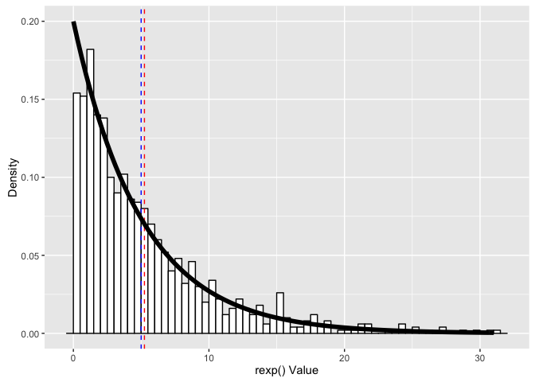
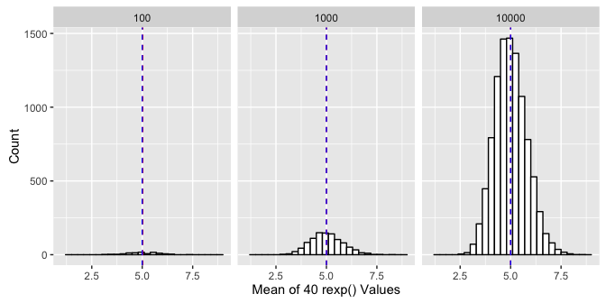
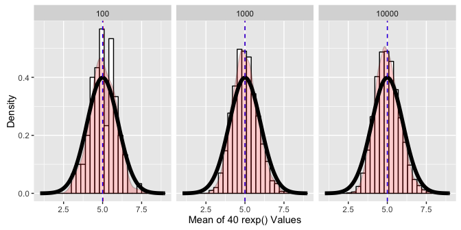

# Statistical Inference - Project Part 1 <br> Central Limit Theorem

This analysis will investigate the distribution of the average of 40 random exponential values (lambda = 0.2)

1. Show where the distribution is centered at and compare it to the theoretical center of the distribution.   
2. Show how variable it is and compare it to the theoretical variance of the distribution.   
3. Show that the distribution is approximately normal. Note that for point 3, focus on the difference between the distribution of a large collection of random exponentials and the distribution of a large collection of averages of 40 exponentials.    


## Exp Distribution:

To get an understanding of the exp distribution, plotted random values (n=1000, lambda=0.2):

\

```
##    average variance       sd
## 1 5.242406 26.54291 5.151981
```

* Theoretical Exp Distribution Mean = 1 / lambda = 1 / 0.2 = 5  
* Theoretical Exp Distribution Variance = 1 / lambda^2 = 1 / 0.2^2 = 25  
* Theoretical Exp Distribution Standard Deviation = 1 / lambda = 1 / 0.2 = 5  

*The exp distribution is centered at 5.242 (dashed red line), which is approximately equal to the theoretical center/mean (5) (dashed blue line). Likewise, the variance is 26.54, which is approximately equal to the theoretical variance (25).* 

*Also, the shape of the distribution closely matches the shape of the theoretical exp distribution (bold black line).* 

## Average of 40 Random Exp Distribution:

Ran simulations (n=100, n=1,000, and n=10,000) of the average/mean of 40 random exp values (lambda=0.2):


```
## Warning: Removed 6 rows containing missing values (geom_bar).
```

\

```
## Warning: Removed 6 rows containing missing values (geom_bar).
```

\

```
##       n  average  variance        sd
## 1   100 5.026630 0.6376638 0.7985386
## 2  1000 5.002670 0.6488200 0.8054936
## 3 10000 5.001438 0.6318527 0.7948916
```

* Theoretical Center of Average Distribution = 1 / lambda = 1 / 0.2 = 5   
* Theoretical Variance of Average Distribution = Population Variance / Sample Size = 25 / 40 = 0.625   
* Theoretical Standard Derivation of Average Distribution = 5 / sqrt(40) = 0.791

*The average distribution is centered at 5.027 (n=100), 5.003 (n=1,000), and 5.001 (n=10,000) (red dashed line), which is approximately equal to the theoretical center/mean (5, the center of the exp distribution) (blue dashed line). The variance is 0.6377 (n=100), 0.6488 (n=1,000), and 0.6319 (n=10,000), which is approximately equal to the theoretical variance (0.625).*

*The biggest simulation size (n=10,000) had the mean/variance closest to theoretical values, which is expected. As the number of simulations increased from 100 to 1,000 to 10,000, the mean/variance values approached the theoretical values. The less simulations, the more variable the results will be; likewise, the more simulations, the less variable the results will be.*

*Also, the shape of the distribution (red fill) closely matches the shape of the normal distribution (bold black line). Hence this analysis has confirmed the Central Limit Theorem (CLT), which states that the arithmetic mean of a sufficiently large number of iterates of independent random variables will be approximately normally distributed, regardless of the underlying distribution.*


## APPENDIX:

### Methods

Analysis was preformed on:

* R: 3.1.1 
* Rstuido: Version 0.98.1073 
* Operating System: Mac OS X 10.9.5 
* Hardware: Macbook Pro, 2.2 ghz Intel Core 2 Duo, 3 GB RAM 

### R Code

#### Libraries and Variables 


```r
## libraries 
library(ggplot2)
```


```r
## variables 
exp_n <- 1000            ## exp distriubtion sample size
nosim_1 <- 100           ## number of simulations #1
nosim_2 <- 1000          ## number of simulations #2
nosim_3 <- 10000         ## number of simulations #3
n <- 40                  ## number of rexp()
lambda <- 0.2            ## exp rate/lambda
set.seed(5150)           ## set seed for reproducible research, random values

## initilize empty vectors to store simulation averages
results_sim_1 <- vector('numeric')
results_sim_2 <- vector('numeric')
results_sim_3 <- vector('numeric')
```

#### Exp Distribution 


```r
## generate exp distribution data
data_exp <- data.frame("data_exp"=rexp(exp_n, lambda))

## calculate average, variance, and standard deviation 
stats_exp <- data.frame("average" = c( mean(data_exp$data_exp)),
                         "variance" = c( var(data_exp$data_exp)),
                         "sd" = c( sd(data_exp$data_exp)) )
exp_mean <- mean(data_exp$data_exp)

## plot exp distrubiton 
g0 <- ggplot(data_exp, aes(x=data_exp)) +
     geom_histogram(aes(y=..density..), binwidth=0.5, colour="black", fill="white") +
     labs(x = "rexp() Value") + labs(y = "Density") +
     geom_vline(aes(xintercept = exp_mean),
                color="red", linetype="dashed", size=0.5) +
     geom_vline(aes(xintercept = (1/lambda) ),
               color="blue", linetype="dashed", size=0.5) +
     stat_function(fun = dexp, size = 2, colour="black", arg = list(rate = lambda) )
```

#### Average of 40 Random Exp Distribution


```r
## loop for simulations with 3 different sample sizes (i.e. 100,1,000,10,000)
## take average of rexp() values and collect in results_sim vectors
for (i in 1 : nosim_1) {
     results_sim_1 <- c(results_sim_1, mean( rexp(n, lambda) ) ) }
for (i in 1 : nosim_2) {
     results_sim_2 <- c(results_sim_2, mean( rexp(n, lambda) ) ) }
for (i in 1 : nosim_3) {
     results_sim_3 <- c(results_sim_3, mean( rexp(n, lambda) ) ) }

## reoganize data into data.frame for easier plotting 
data_1 <- data.frame("n" = rep(nosim_1,nosim_1), "average" = results_sim_1)
data_2 <- data.frame("n" = rep(nosim_2,nosim_2), "average" = results_sim_2)
data_3 <- data.frame("n" = rep(nosim_3,nosim_3), "average" = results_sim_3)
data_sims <- rbind(data_1, data_2, data_3)

## calculate average, variance, and standard deviation 
stats_sims <- data.frame("n" = c(nosim_1, nosim_2, nosim_3),
                   "average" = c( mean(results_sim_1), mean(results_sim_2), mean(results_sim_3) ),
                   "variance" = c( var(results_sim_1), var(results_sim_2), var(results_sim_3) ),
                   "sd" = c( sd(results_sim_1), sd(results_sim_2), sd(results_sim_3) ) )
```

#### Plots


```r
## histograms
vline.data <- data.frame(z = c(mean(results_sim_1), mean(results_sim_2), mean(results_sim_3)), 
                         n = c(nosim_1, nosim_2, nosim_3))
g1 <- ggplot(data_sims, aes(x=average)) + facet_grid(. ~ n) + xlim(1,9) +
     geom_histogram(binwidth=.3, colour="black", fill="white") +
     labs(x = "Mean of 40 rexp() Values") + labs(y = "Count") +
     geom_vline(aes(xintercept = z), vline.data,
                color="red", linetype="dashed", size=0.5) +
     geom_vline(aes(xintercept = (1/lambda) ),
               color="blue", linetype="dashed", size=0.5) 

## compare to normal distribution with mean of 1/lambda
g2 <- ggplot(data_sims, aes(x=average)) + facet_grid(. ~ n) + xlim(1,9) +
     geom_histogram(aes(y=..density..), binwidth=.3, colour="black", fill="white") +
     labs(x = "Mean of 40 rexp() Values") + labs(y = "Density") +
     geom_density(alpha=.2, fill="red") +
     stat_function(fun = dnorm, size = 2, colour="black", arg = list(mean = (1/lambda) ) ) +
     geom_vline(aes(xintercept = z), vline.data,
                color="red", linetype="dashed", size=0.5) +
     geom_vline(aes(xintercept = (1/lambda) ),
               color="blue", linetype="dashed", size=0.5) 
```
