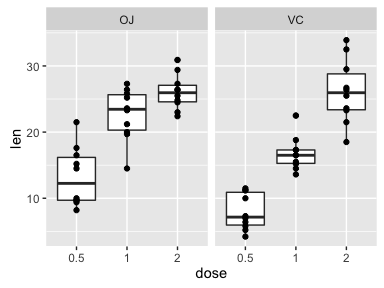
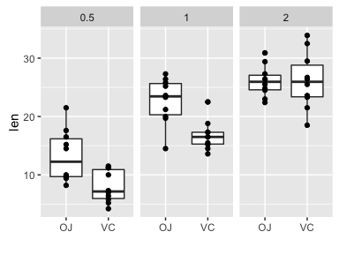
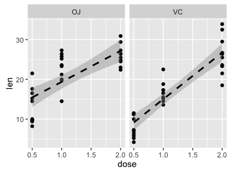

# Statistical Inference - Project Part 2 <br> ToothGrowth Data Analysis

The analysis will conduct a basic exploratory analysis of the ToothGrowth dataset and determine the statistical differences in the len data grouped by the supp and dose variables. 
 
1. Load the ToothGrowth data and perform some basic exploratory data analyses 
2. Provide a basic summary of the data.
3. Use confidence intervals and/or hypothesis tests to compare tooth growth by supp and dose.
4. State your conclusions and the assumptions needed for your conclusions. 

## Exploratory Data Analyses 


### Preview Data

Previewed the ToothGrowth data. 


```
## 'data.frame':	60 obs. of  3 variables:
##  $ len : num  4.2 11.5 7.3 5.8 6.4 10 11.2 11.2 5.2 7 ...
##  $ supp: Factor w/ 2 levels "OJ","VC": 2 2 2 2 2 2 2 2 2 2 ...
##  $ dose: num  0.5 0.5 0.5 0.5 0.5 0.5 0.5 0.5 0.5 0.5 ...
```

```
##       len        supp         dose      
##  Min.   : 4.20   OJ:30   Min.   :0.500  
##  1st Qu.:13.07   VC:30   1st Qu.:0.500  
##  Median :19.25           Median :1.000  
##  Mean   :18.81           Mean   :1.167  
##  3rd Qu.:25.27           3rd Qu.:2.000  
##  Max.   :33.90           Max.   :2.000
```

```
##    len supp dose
## 1  4.2   VC  0.5
## 2 11.5   VC  0.5
## 3  7.3   VC  0.5
## 4  5.8   VC  0.5
## 5  6.4   VC  0.5
## 6 10.0   VC  0.5
```

```
##     len supp dose
## 55 24.8   OJ    2
## 56 30.9   OJ    2
## 57 26.4   OJ    2
## 58 27.3   OJ    2
## 59 29.4   OJ    2
## 60 23.0   OJ    2
```

### Plots

Plotted data grouped by dose and supp variables. 


\

\

\

### Statistics

Conducted basic statistics on data grouped by dose and supp. 


```
## Source: local data frame [6 x 7]
## Groups: supp [2]
## 
##     supp  dose len-n len-mean len-variance   len-sd len-median
##   (fctr) (dbl) (int)    (dbl)        (dbl)    (dbl)      (dbl)
## 1     OJ   0.5    10    13.23    19.889000 4.459709      12.25
## 2     OJ   1.0    10    22.70    15.295556 3.910953      23.45
## 3     OJ   2.0    10    26.06     7.049333 2.655058      25.95
## 4     VC   0.5    10     7.98     7.544000 2.746634       7.15
## 5     VC   1.0    10    16.77     6.326778 2.515309      16.50
## 6     VC   2.0    10    26.14    23.018222 4.797731      25.95
```

## Statistical Inference 

### Single Sample T-Test 95% Confidence Interval

Calculated 95% confidence intervals on len data grouped by dose and supp variables.  


```
## Source: local data frame [6 x 4]
## Groups: supp [?]
## 
##     supp  dose 95%-Confidence-Left 95%-Confidence-Right
##   (fctr) (dbl)               (dbl)                (dbl)
## 1     OJ   0.5           10.039717            16.420283
## 2     OJ   1.0           19.902273            25.497727
## 3     OJ   2.0           24.160686            27.959314
## 4     VC   0.5            6.015176             9.944824
## 5     VC   1.0           14.970657            18.569343
## 6     VC   2.0           22.707910            29.572090
```

### Hypothesis Testing, Two Sample T-Test 95% Confidence Interval

Conducted hypothesis testing on the mean difference of len data grouped by dose and supp variables. 


```
## Source: local data frame [9 x 2]
## 
##   95%-Confidence-Left 95%-Confidence-Right
##                 (dbl)                (dbl)
## 1           -8.780943           -1.7190573
## 2           -9.057852           -2.8021482
## 3           -3.638070            3.7980705
## 4          -11.265712           -6.3142880
## 5          -13.054267           -5.6857333
## 6          -21.901512          -14.4184880
## 7          -13.415634           -5.5243656
## 8           -6.531443           -0.1885575
## 9          -16.335241           -9.3247594
```

## RESULTS:

Statistical significance/difference (95%) of the ToothGrowth data was determined via confidence intervals and hypothesis tests (t-tests). Non-overlapping 95% confidence intervals indicated statistical difference. Furthermore, hypothesis tests (difference of two means) that had confidence intervals not containing 0 indicated statistical difference, while confidence intervals containing 0 indicated no statistical difference.

*Supp: OJ vs. VC at 0.5 and 1.0 dose were statistically different, while OJ vs. VC at 2.0 dose were not statistically different.*   
*Dose: For OJ, 0.5, 1.0, and 2.0 were all statistically different. Also, for VC, 0.5, 1.0, and 2.0 were all statistically different.*

## CONCLUSIONS:

*Assumptions: ToothGrowth data is unpaired and samples do not have equal variance. I was not sure about the data, hence I went with these choices because it was suggested to be conservative in the class lecture.*

*Conclusions: OJ had a statistically greater len than VC at the 0.5 and 1.0 doses. There was no statistical difference between the len of OJ and VC at the 2.0 dose. As dose increased from 0.5 to 1.0 to 2.0, the len was statistically greater for both OJ and VC.*  

## APPENDIX:

### Methods

Analysis was preformed on:

* R: 3.1.1 
* Rstuido: Version 0.98.1073 
* Operating System: Mac OS X 10.9.5 
* Hardware: Macbook Pro, 2.2 ghz Intel Core 2 Duo, 3 GB RAM 

### R Code

#### Exploratory Data Analysis 


```r
## libraries 
library(dplyr); library(datasets); library(ggplot2)
```

##### Load Data


```r
## load ToothGrowth data
data(ToothGrowth); ToothGrowth_df<- tbl_df(ToothGrowth)
```

##### Preview Data


```r
## preview data
str(ToothGrowth)
summary(ToothGrowth)
head(ToothGrowth)
tail(ToothGrowth)
```

##### Plots


```r
## plots for basic exploratory data analyses 
g1 <- ggplot(ToothGrowth_df, aes(x=factor(dose), y=len)) + 
     geom_boxplot() + facet_grid(. ~ supp) + geom_point(color="black") + labs(x = "dose") 
g2 <- ggplot(ToothGrowth_df, aes(x=factor(supp), y=len)) + 
     geom_boxplot() + facet_grid(. ~ dose) + geom_point(color="black") + labs(x = "") 
g3 <-  ggplot(ToothGrowth_df, aes(x=dose, y=len)) + 
     geom_point() + facet_grid(. ~ supp) + labs(x = "dose") +
     geom_smooth(method = "lm", se=TRUE, col="black", lty="dashed") 
```


```r
# display basic exploratory data analyses plots
g1; g2; g3
```

##### Statistics


```r
## group data by supp and dose, perform basic stats 
by_supp_dose <- group_by(ToothGrowth_df, supp, dose)
ToothGrowth_df_stats <- summarize(by_supp_dose, 
                                  "len-n" = length(len), "len-mean" = mean(len),
                                  "len-variance" = var(len), "len-sd" = sd(len), 
                                  "len-min" = quantile(len,0), "len-1st-quantile" = quantile(len,.25), 
                                  "len-median" = quantile(len,.5), "len-3rd-quantile" = quantile(len,.75), 
                                  "len-max" = quantile(len,1) )
```


```r
# display stat tables 
ToothGrowth_df_stats[,c(1,2,3,4,5,6,9)]
```

#### Statistical Inference 

##### Single Sample T-Test 95% Confidence Interval


```r
## calculate 95% confidence intervals
ToothGrowth_df_ci <- summarize(by_supp_dose, 
                               "95%-Confidence-Left" = t.test(len)[[4]][1], 
                               "95%-Confidence-Right" = t.test(len)[[4]][2] )
```


```r
## display 95% confidence intervals
## single sample t-test
ToothGrowth_df_ci
```

##### Hypothesis Testing, Two Sample T-Test 95% Confidence Interval


```r
## hypothesis testing, two sample t-test

## OJ 0.5 vs. VC 0.5, OJ 1.0 vs. VC 1.0, OJ 2.0 vs. VC 2.0
OJ_0.5_vs_VC_0.5 <- t.test(as.matrix(ToothGrowth_df[1:10,1]), as.matrix(ToothGrowth_df[31:40,1]), paired=FALSE, var.equal=FALSE)$conf[1:2]
OJ_1.0_vs_VC_1.0 <- t.test(as.matrix(ToothGrowth_df[11:20,1]), as.matrix(ToothGrowth_df[41:50,1]), paired=FALSE, var.equal=FALSE)$conf[1:2]
OJ_2.0_vs_VC_2.0 <- t.test(as.matrix(ToothGrowth_df[21:30,1]), as.matrix(ToothGrowth_df[51:60,1]), paired=FALSE, var.equal=FALSE)$conf[1:2]

## OJ 0.5 vs. OJ 1.0, OJ 1.0 vs. OJ 2.0, OJ 0.5 vs. OJ 2.0 
OJ_0.5_vs_OJ_1.0 <- t.test(as.matrix(ToothGrowth_df[1:10,1]), as.matrix(ToothGrowth_df[11:20,1]), paired=FALSE, var.equal=FALSE)$conf[1:2]
OJ_1.0_vs_OJ_2.0 <- t.test(as.matrix(ToothGrowth_df[11:20,1]), as.matrix(ToothGrowth_df[21:30,1]), paired=FALSE, var.equal=FALSE)$conf[1:2] 
OJ_0.5_vs_OJ_2.0 <- t.test(as.matrix(ToothGrowth_df[1:10,1]), as.matrix(ToothGrowth_df[21:30,1]), paired=FALSE, var.equal=FALSE)$conf[1:2]  

## VC 0.5 vs. VC 1.0, VC 1.0 vs. VC 2.0, VC 0.5 vs. VC 2.0 
VC_0.5_vs_VC_1.0 <- t.test(as.matrix(ToothGrowth_df[31:40,1]), as.matrix(ToothGrowth_df[41:50,1]), paired=FALSE, var.equal=FALSE)$conf[1:2]
VC_1.0_vs_VC_2.0 <- t.test(as.matrix(ToothGrowth_df[41:50,1]), as.matrix(ToothGrowth_df[51:60,1]), paired=FALSE, var.equal=FALSE)$conf[1:2]
VC_0.5_vs_VC_2.0 <- t.test(as.matrix(ToothGrowth_df[31:40,1]), as.matrix(ToothGrowth_df[51:60,1]), paired=FALSE, var.equal=FALSE)$conf[1:2] 

# combine data in table
ttests <- rbind(OJ_0.5_vs_VC_0.5, OJ_1.0_vs_VC_1.0, OJ_2.0_vs_VC_2.0,
                OJ_0.5_vs_OJ_1.0, OJ_1.0_vs_OJ_2.0, OJ_0.5_vs_OJ_2.0,
                VC_0.5_vs_VC_1.0, VC_1.0_vs_VC_2.0, VC_0.5_vs_VC_2.0)
ttests <- tbl_df(data.frame(ttests))
colnames(ttests) <- c("95%-Confidence-Left", "95%-Confidence-Right")
```


```r
## display hypothesis testing 95% confidence intervals
## two sample t-test, assume unpaired and variance not equal data
ttests
```
